&nbsp;

### About

AI/ML student, mostly working in Python and JavaScript. I care more about understanding how something works than just getting it to run — so a lot of what ends up here started as an experiment rather than a plan.

Repos are a mix of finished work and things still taking shape. I push as they become usable, not once they're perfect.

&nbsp;

### Skills

**Languages**

**Frontend**

**Tools**

&nbsp;

### GitHub Stats

<table>
<tr>
<td>

</td>
<td>

</td>
</tr>
</table>

&nbsp;

### Contact

&nbsp;

